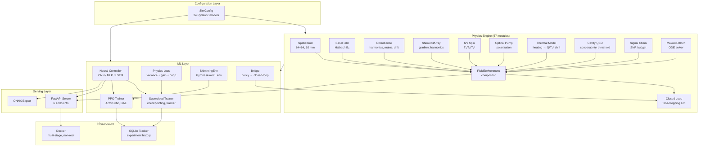
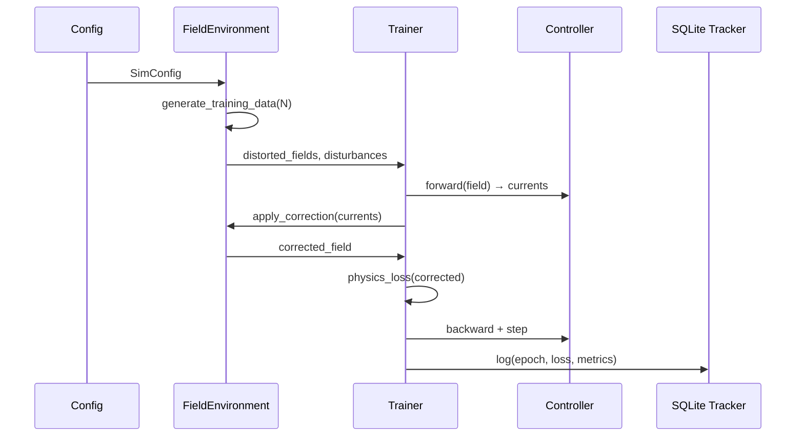
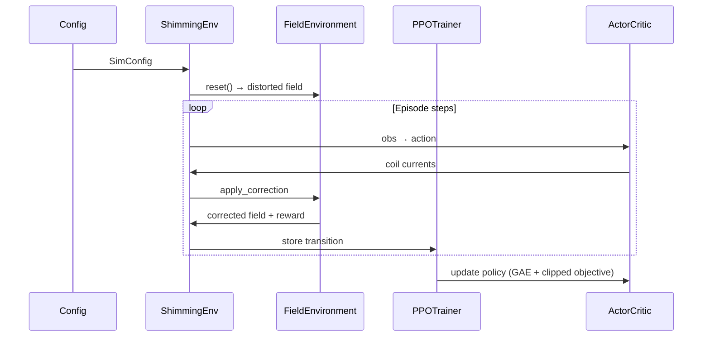
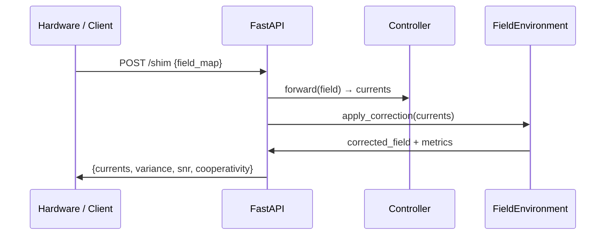

# Architecture

> NV Maser "Tricorder" Digital Twin — system architecture overview.

## System Diagram



## Layer Dependencies

```
config.py (SimConfig — 24 Pydantic models)
    │
    ├── physics/  ← config only
    │   ├── grid.py, base_field.py, disturbance.py, coils.py
    │   ├── nv_spin.py, optical_pump.py, thermal.py
    │   ├── cavity.py, signal_chain.py, maxwell_bloch.py
    │   ├── environment.py  ← composes all physics
    │   └── closed_loop.py  ← time-stepping simulator
    │
    ├── model/  ← config + physics
    │   ├── controller.py  (CNN / MLP / LSTM factory)
    │   ├── loss.py         (physics-informed: variance + gain_budget + cooperativity)
    │   └── training.py     (supervised loop + checkpointing)
    │
    ├── rl/  ← config + physics + model
    │   ├── env.py    (ShimmingEnv — Gymnasium wrapper over FieldEnvironment)
    │   ├── ppo.py    (ActorCritic, GAE, RolloutBuffer, PPOTrainer)
    │   └── bridge.py (load trained policy → closed-loop validation)
    │
    └── api/  ← config + physics + model
        └── server.py  (FastAPI — /health /shim /metrics /reload /info /ui)
```

## Data Flow

### Supervised Training Path



### RL Training Path



### Inference / Serving Path



## Physics Module Map

| Domain | Modules | Key Outputs |
|--------|---------|-------------|
| **Field Generation** | `base_field`, `halbach`, `planar_gradient`, `depth_profile` | B₀ map (T) |
| **Disturbance** | `disturbance`, `thermal`, `quantum_noise`, `artifact_characterizer` | ΔB perturbations |
| **NV Dynamics** | `nv_spin`, `optical_pump`, `pulsed_pump` | T₂*, pump efficiency |
| **Cavity & Maser** | `cavity`, `maser_gain`, `q_boost`, `gain_lock` | Q, cooperativity, gain budget |
| **Signal Chain** | `signal_chain`, `snr_calculator`, `sensitivity` | SNR (dB), noise temperature |
| **Time-Domain** | `maxwell_bloch`, `spectral_maxwell_bloch` | Output power, photon number |
| **Spectral** | `spectral`, `dipolar`, `spin_squeezing`, `superradiance` | Inversion profiles, coupling |
| **Shimming** | `grid`, `coils`, `surface_coil`, `feedback`, `closed_loop` | Corrected field, loop metrics |
| **Adapters** | `magpylib_adapter`, `sigpy_adapter`, `epg_adapter`, `mrzero_adapter`, `susceptibility_adapter` | External library bridges |
| **Validation** | `phase1_validator`, `phase4_validator`, `phase6_validator`, `phase9_validator` | Pass/fail + diagnostic dicts |

## Configuration Tree

`SimConfig` composes 24 Pydantic sub-models:

```
SimConfig
├── grid: GridConfig              # 64×64, 10 mm, 0.6 active fraction
├── field: FieldConfig            # B₀ = 50 mT, optional gradient
├── halbach: HalbachConfig        # Halbach geometry & tolerances
├── disturbance: DisturbanceConfig # Harmonics, mains, transients, drift
├── coils: CoilConfig             # Shim coil count & max current
├── nv: NVConfig                  # NV density, T₁/T₂/T₂*, pump efficiency
├── maser: MaserConfig            # Cavity Q, frequency, min gain budget
├── cavity: CavityConfig          # Mode volume, mirror reflectivity
├── optical_pump: OpticalPumpConfig # Power, wavelength, pulsed mode
├── signal_chain: SignalChainConfig # ADC/DAC bits, noise, temperature
├── model: ModelConfig            # Architecture, hidden size, layers
├── training: TrainingConfig      # LR, epochs, reward shaping
├── feedback: FeedbackConfig      # Hall sensor count, DAC bits
├── thermal: ThermalConfig        # Initial temp, cooling coefficient
├── viz: VizConfig                # Plot options
├── maxwell_bloch: MaxwellBlochConfig # Enable, duration, tolerances
├── spectral: SpectralConfig      # Enable, linewidth, detuning grid
├── dipolar: DipolarConfig        # Enable, NV density
├── single_sided_magnet: SingleSidedMagnetConfig
├── surface_coil: SurfaceCoilConfig
├── susceptibility: SusceptibilityConfig
└── depth_profile: DepthProfileConfig
```

## API Endpoints

| Method | Path | Purpose |
|--------|------|---------|
| `GET` | `/health` | Uptime, grid size, coil count, architecture |
| `POST` | `/shim` | Primary inference: field map → coil currents + physics metrics |
| `GET` | `/metrics` | Prometheus-compatible counters & latency |
| `GET` | `/info` | Model metadata & capability summary |
| `POST` | `/reload` | Hot-reload model checkpoint & config |
| `GET` | `/ui` | Interactive web dashboard |

Authentication: optional `X-API-Key` header (set via `NV_MASER_API_KEY` env var).

## Key Design Decisions

See `docs/adr/` for formal Architecture Decision Records.

| Decision | Rationale |
|----------|-----------|
| **Pydantic config** | Single source of truth; JSON-serializable; validation built-in |
| **Frozen dataclasses** for physics results | Immutable, typed, IDE-friendly; `MaserMetrics`, `UniformityReport` |
| **`FieldEnvironment` compositor** | Isolates physics from ML; single call produces all metrics |
| **Gymnasium RL env** | Standard interface; compatible with any RL library |
| **SQLite experiment tracker** | Zero-dependency; local-first; no cloud lock-in |
| **Multi-stage Docker** | Minimal runtime image; non-root; read-only filesystem |
| **ONNX export** | Cross-runtime deployment (C++, WASM, edge devices) |
